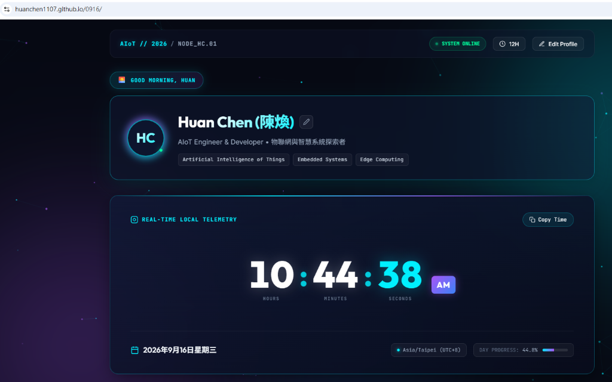
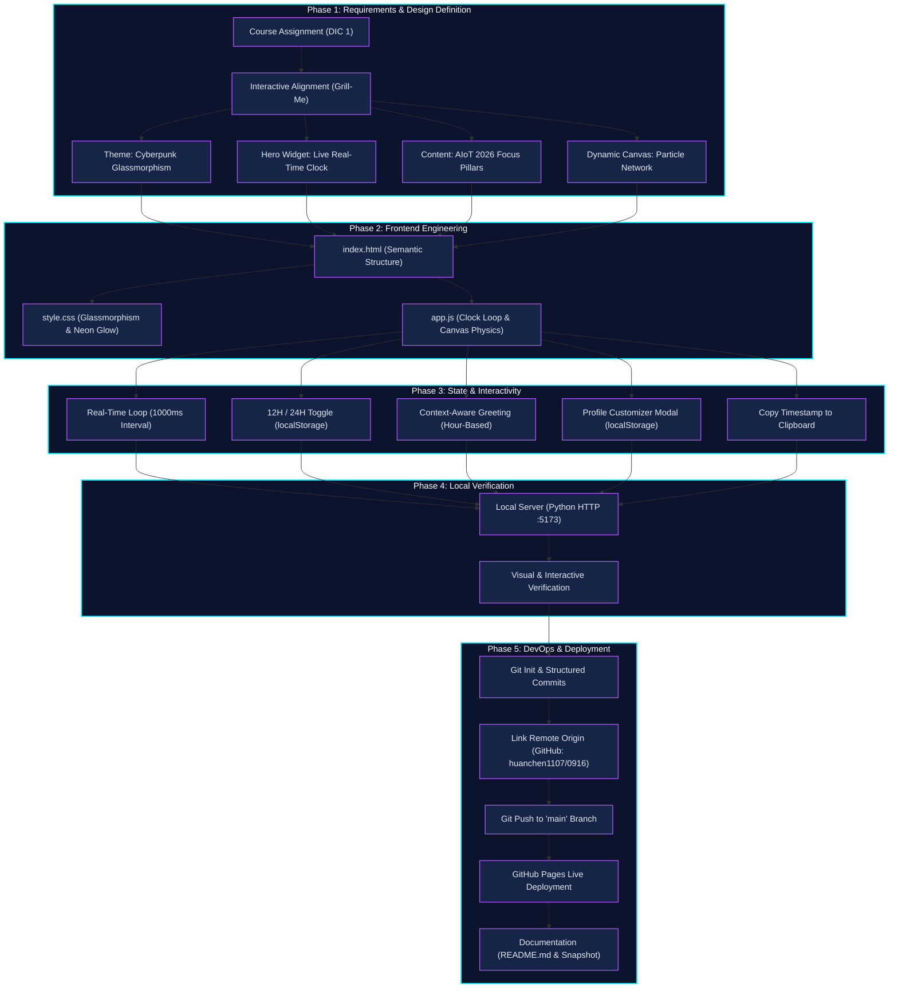

# AIoT 2026: Interactive Personal Dashboard & Real-Time Telemetry Interface
> **Assignment**: DIC 1 (Do In Class 1) — Personal Page & Live Time System  
> **Author**: Huan Chen (陳煥)  
> **Course**: Artificial Intelligence of Things (AIoT 2026)  
> **Repository**: [https://github.com/huanchen1107/0916](https://github.com/huanchen1107/0916)

---

## 🔗 Live Demonstration

👉 **Live Demo**: [https://huanchen1107.github.io/0916/](https://huanchen1107.github.io/0916/)



---

## 📖 Project Overview & Objectives

This project is a modern, high-performance personal dashboard created for **DIC 1 (Do In Class 1)**. It bridges real-time temporal telemetry with front-end interactive design, reflecting the identity and focus areas of an AIoT engineer.

### Key Objectives:
1. **Dynamic Identity**: Display author name (**Huan Chen / 陳煥**) with inline customization backed by browser `localStorage`.
2. **Real-Time Clock Telemetry**: Implement a live ticking digital clock with 12H/24H toggling, full calendar date, timezone detection, and day progress tracking.
3. **Context-Aware Experience**: Adapt page greetings based on the visitor's local hour.
4. **Rich Cyberpunk Aesthetics**: Apply frosted glassmorphism (`backdrop-filter: blur`), glowing ambient aura, and interactive HTML5 particle canvas physics.
5. **DevOps & Cloud Hosting**: Maintain disciplined Git version control and deploy continuously on GitHub Pages.

---

## 🚀 Core Features

- ⏱️ **Real-Time Hero Clock**: Updates hours, minutes, and seconds every 1,000 ms with smooth transitions.
- 🔄 **12H / 24H Format Switcher**: Instant toggle between 12-hour AM/PM and 24-hour military format, remembered across sessions.
- 🌅 **Dynamic Greeting Engine**: Contextual greetings that adjust to the time of day (`Good morning`, `Good afternoon`, `Good evening`, `Night mode active`).
- 📋 **Copy Timestamp Tool**: One-click export of ISO and local timestamps to clipboard with animated toast notification.
- 🌌 **Interactive Particle Canvas**: Custom HTML5 canvas particle network reacting to cursor movement and calculating node proximity lines.
- 🧠 **AIoT 2026 Curriculum Grid**: Showcases research pillars (TinyML, Sensor Telemetry, Intelligent Automation), technical arsenal tags, and simulated live node diagnostics.
- ✏️ **Profile Customizer Modal**: Enables in-browser editing of display name and title with persistent state.

---

## 🛠️ Technology Stack

| Layer | Technology | Description & Usage |
| :--- | :--- | :--- |
| **Structure** | HTML5 Semantic Elements | Accessible document layout (`<header>`, `<main>`, `<article>`, `<canvas>`, `<footer>`) |
| **Styling** | Vanilla CSS3 | Cyberpunk palette, glassmorphism, responsive grid & flexbox, keyframe glow animations |
| **Typography** | Google Fonts | `Outfit` (clock/headings), `Inter` (body copy), `JetBrains Mono` (badges/code) |
| **Logic** | Vanilla JavaScript (ES6+) | Real-time interval clock, canvas particle simulation, clipboard API, `localStorage` |
| **Hosting & CI/CD** | GitHub Pages & Git | Source version control and automated static cloud hosting |

---

## 📊 Project Workflow



### Phase Breakdown:
1. **Requirements & Alignment**: Clarified personal branding (**Huan Chen / 陳煥**), cyberpunk aesthetic, and dynamic timekeeping goals.
2. **Frontend Construction**: Built semantic `index.html`, responsive glassmorphism styles in `style.css`, and modular JS in `app.js`.
3. **State Management**: Integrated `localStorage` to save user profile and clock format preferences.
4. **Local Verification**: Tested responsiveness, animations, and real-time clock loops via a local development server.
5. **Cloud Deployment**: Pushed code to GitHub repository and enabled GitHub Pages for global access.

---

## 📦 How to Run Locally

1. **Clone the repository**:
   ```bash
   git clone https://github.com/huanchen1107/0916.git
   cd 0916
   ```

2. **Open directly**:
   - Double-click `index.html` to open in any web browser.

3. **Or serve via Python**:
   ```bash
   python -m http.server 5173
   ```
   Navigate to [http://localhost:5173](http://localhost:5173) in your browser.

---

## 📂 Repository Structure

```
.
├── .gitignore          # Git exclusion rules
├── README.md           # Comprehensive project documentation & workflow
├── app.js              # Clock logic, greeting engine, canvas particle animation
├── demo_preview.png    # Live preview snapshot of the web application
├── index.html          # Semantic HTML5 layout and modal structures
└── style.css           # Cyberpunk styling, glassmorphic panels, and animations
```

---

© 2026 **Huan Chen (陳煥)** • AIoT Laboratory
